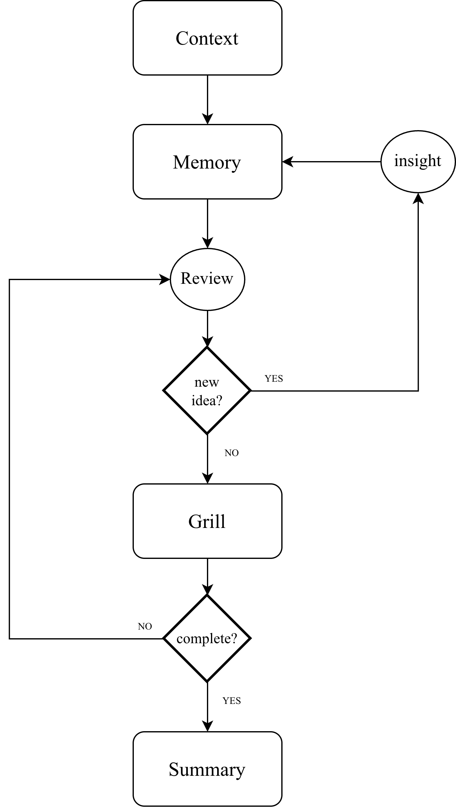

# Aha

Aha is an installable Pi extension for an Insight-to-Judgment workflow: you bring a current thought, Aha retrieves relevant old notes, and the agent helps you review evidence before producing a session-local summary draft.

Aha is for people who want retrieval and questioning help without outsourcing judgment or writing. Source notes remain yours; Aha does not mutate Obsidian notes, publish Judgment Cards, or auto-ingest new knowledge.

<p align="center">
  
</p>

## Prerequisites

Supported envelope:

- macOS or Linux.
- Node.js `>=22.19.0 <26`.
- Bun `>=1.2.0 <2` for builds.
- Pi `@earendil-works/pi-coding-agent >=0.79.0 <0.80.0`.
- QMD available as `qmd` or via `QMD_BIN`.
- Obsidian CLI available as `obsidian` or via `OBSIDIAN_BIN` when source-note/backlink helpers are needed.

See [`docs/install.md`](./docs/install.md) for the supported-version matrix.

## Install

```bash
git clone git@github.com:Timisic/Aha.git
cd Aha/insight-package
npm ci
npm run verify
pi install .
```

One-off smoke load from the repository root:

```bash
pi --verbose --offline --no-tools --no-extensions -e ./insight-package --print ""
```

The package is intended for public Git-based installation today. npm publication can be added later; package metadata and license are present for reuse.

## Run `/insight doctor`

Inside Pi:

```text
/insight doctor
```

For CI/agent-readable output:

```text
/insight doctor --json
```

Doctor checks host support, package/API shape, duplicate extension loading, writable session storage, QMD binary/index/collection, Obsidian CLI availability, reranker mode, source roots, privacy mode, and timeout/config values. It does not enumerate or print real note contents.

## First synthetic demo

Before connecting a personal vault, run the repository-owned offline demo:

```bash
cd Aha
npm --prefix insight-package run demo:offline
```

The demo creates temporary fake QMD/Obsidian binaries, points Aha at `insight-package/demo-vault/`, runs doctor, starts a sample `/insight`, retrieves two synthetic candidates with reranking off, prints the session artifact path, and deletes the temp state unless `-- --keep` is passed.

## Connect a real vault

Set only the values that differ from defaults:

```bash
export QMD_BIN=qmd
export OBSIDIAN_BIN=obsidian
export INSIGHT_QMD_INDEX=obsidian
export INSIGHT_QMD_COLLECTION=obsidian
export INSIGHT_SOURCE_ROOTS="$HOME/Obsidian Notes:$PWD"
# Offline/no-agent reranking path:
export INSIGHT_MEMORY_RERANKER=off
```

Then run `/insight doctor` again. If it passes required checks, start a real session:

```text
/insight
```

Paste the current thought, context, optional source note, and optional old-note cues.

## Normal workflow

```text
/insight
/insight <raw thought and context>
/insight list
/insight resume <session-id-or-directory>
/insight current
/insight doctor
```

Workflow shape:

```text
raw insight + context
-> QMD retrieval and optional Obsidian backlink expansion
-> compact candidate table: Note | Relation | Hit | Why
-> user review of evidence
-> Review-Grill questioning
-> user-confirmed readiness
-> session-local summary-draft.md
```

## Configuration and data boundaries

Complete defaults live in [`docs/configuration.md`](./docs/configuration.md). Key defaults:

- `INSIGHT_HOME`: `~/.pi/agent/insights/` or `$PI_CODING_AGENT_DIR/insights/`.
- `QMD_BIN`: `qmd`.
- `OBSIDIAN_BIN`: `obsidian`.
- `INSIGHT_MEMORY_RERANKER`: `agent`; set `off` or `none` for offline-safe demos.
- `INSIGHT_QMD_TIMEOUT_MS`: `90000`.
- `INSIGHT_OBSIDIAN_TIMEOUT_MS`: `8000`.

Session artifacts:

```text
insights/
  index.json
  sessions/
    yyyy-mm-dd-short-slug-sessionid/
      state.json
      grill-context.md
      stage-briefing.md
      summary-draft.md
```

Aha writes only local session artifacts. It does not modify source notes by default.

## Troubleshooting

See [`docs/troubleshooting.md`](./docs/troubleshooting.md). Common first fixes:

```bash
export INSIGHT_MEMORY_RERANKER=off
export INSIGHT_HOME="$PWD/.aha-insights"
export QMD_BIN=/path/to/qmd
export OBSIDIAN_BIN=/path/to/obsidian
```

If doctor reports duplicate extension loading, remove the old single-file extension or rename it with a non-`.ts` suffix.

## Update, rollback, uninstall, and data deletion

Update:

```bash
git pull --ff-only
cd insight-package
npm ci
npm run verify
pi install .
```

Rollback by checking out the previous Git revision and reinstalling. Uninstall by removing the package from Pi settings.

Archive or delete session data:

```bash
tar -czf aha-insights-archive.tgz "${INSIGHT_HOME:-${PI_CODING_AGENT_DIR:-$HOME/.pi/agent}/insights}"
rm -rf "${INSIGHT_HOME:-${PI_CODING_AGENT_DIR:-$HOME/.pi/agent}/insights}"
```

## Contributor setup

```bash
cd insight-package
npm ci
npm run typecheck
npm test
npm run test:ultraqa
npm run build
```

Benchmarks are maintainer-oriented and documented in [`bench/README.md`](./bench/README.md). Current report targets remain under `bench/reports/latest/`, with timestamped history under `bench/reports/archive/`.

## License

MIT; see [`LICENSE`](./LICENSE).
