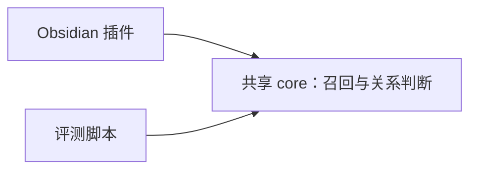

# Aha

**个人长期笔记的 AI 召回与判断辅助工具。**

当形成一个新的想法（insight）时，Aha 从 Obsidian 笔记库里找回相关的旧笔记，并回答一个比"相关"更进一步的问题：这条旧笔记是在支持、挑战、类比还是限定你现在的判断？最终通过 Grilling 追问**让人的历史经验重新参与当前思考**。关键思考只发生在读原文、取舍候选关系、与 AI 追问时，产品只应关注并强化这一过程。

<p align="center">
  
</p>

## 为什么做这个

旧笔记里沉淀过判断、教训、反例和边界，在新问题出现时很难被重新调用。

语义搜索类工具已经把"浮现相关笔记"做得很好，但相似度是**对称、无立场**的信号——它答不了"所以呢"。正确的废话还是废话。一条旧笔记对当前判断的价值，取决于它对这个判断做了什么，即我要的是 Insight × History Note：

| 关系 | 含义 |
|---|---|
| `supports` | 旧内容强化了当前想法 |
| `challenges` | 旧内容让当前想法需要修正 |
| `resembles` | 旧内容来自别的领域，但结构相同 |
| `bounds` | 旧内容说明这个想法适用于哪里、停在哪里 |
| `weak` | 只是主题相近，证据不足 |

人机边界始终是：**human-authored, agent-retrieved**。人写笔记、人判断、人落笔；AI 负责召回、解释关系、提供追问，不改写原文。

## 时间距离

当下判断会被近因和情绪窄化，低谷时人倾向于认为“一直如此、只会更糟”。从时间距离外以旁观视角重看自己的负面经历，情绪反应与反刍都会下降，一周后依然有效；起作用的是重新评估，重新审视。

Aha 的召回天然产生这种距离：写下想法的当下，它把数月甚至数年前与之 `supports` / `challenges` / `bounds` 的旧文字调回来。那是另一种情绪和认知状态下的自己所写，不需要记得，也不需要去翻。**旧笔记是一份不受当前心境污染的证据。**

## 架构

Aha 在 Obsidian 内完成搜索、阅读和反馈。共享核心（`core`）通过 QMD 和笔记链接找回旧笔记，由大模型解释它们与当前想法的关系，并校验原文引句。


```mermaid
flowchart LR
    Plugin[Obsidian 插件] --> Core["共享 core：召回与关系判断"]
    Bench[评测脚本] --> Core
```

插件和评测脚本调用同一份核心逻辑。

## 仓库结构

```text
obsidian-plugin/     Obsidian 插件
  src/core/            检索与判断逻辑，插件和评测脚本共用
  src/*.ts             插件专属：触发、Review Panel、会话状态、设置
scripts/aha/         命令行工具
scripts/bench/       评测入口（run-pipeline-bench 等）
scripts/lib/         Node 侧共享工具：评分、PipelineTrace 等
bench/               评测用例与报告说明（生成物不入库）
docs/                PRD · ADR · 运行细节 · 领域术语 · 归档
```

文档入口见 [docs/README.md](./docs/README.md)；插件运行细节（失败可见性、代理与重试、候选安全）见 [docs/obsidian-plugin-operations.md](./docs/obsidian-plugin-operations.md)。

## 评估：有没有带来 Surprise

**Surprise 是 Aha 的核心产品指标：每轮阅读中，有多少条旧笔记带来了意料之外、又对当前思考有价值的连接。** 比如，一段早已忘记的经历，恰好为眼前的判断补上了一个反例或适用边界。

这个价值由笔记的主人确认。在 Review Panel 中读过原文后，点击 `surprise` 留下标记，也可以记下这次连接带来的想法。Aha 保存这些反馈，供日后回看。

评估围绕每轮由用户标记的 Surprise 数量展开；比较不同方案时，保持相近的阅读预算。标记反映的是用户当下感受到的价值，不能直接证明长期判断能力的改善。

检索与排序的过程诊断留在 [评测文档](./bench/README.md)，用于定位问题。

## 开发与验证

```bash
node --test scripts/aha/tests/**/*.test.mjs   # 检索/judge/评分单测 (unit/integration/e2e)
cd obsidian-plugin && npm run verify       # 插件构建 + 测试
```

## 状态与边界

已支持：Obsidian Plugin（触发、Review Panel、候选跳转、反馈按钮）、多路混合召回、引句校验且采用自然中文说明的关系判断、按非 weak 目标顺序补位的分批 judge、判断预算与停止原因 trace、评测闭环与失败归因。

不做：自动修改 Obsidian 原文、自动沉淀总结、把候选自动写入知识库。

边界：自用驱动的深度产品实验，以真实阅读中的 Surprise 反馈检验产品价值，尚未验证对长期思考与判断的影响。
