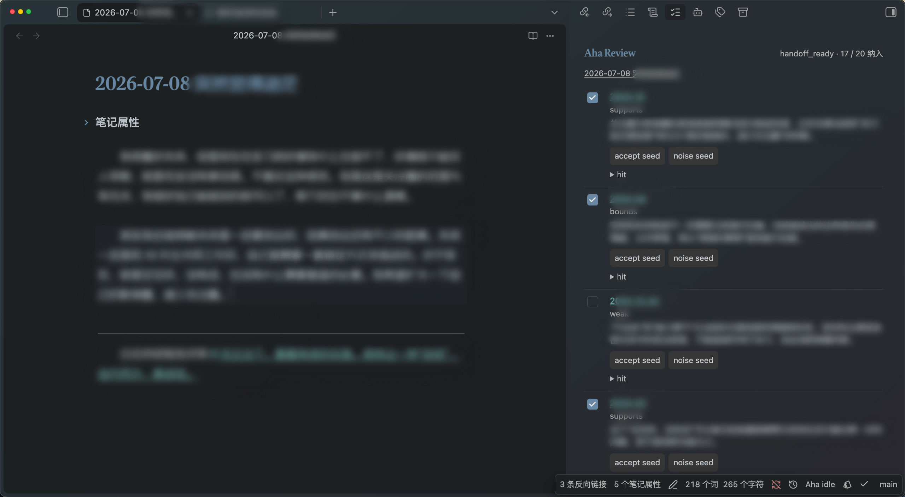

# Aha

**个人长期笔记的 AI 召回与判断辅助工具。**

当形成一个新的想法（insight）时，Aha 从 Obsidian 笔记库里找回相关的旧笔记，并回答一个比"相关"更进一步的问题：这条旧笔记是在支持、挑战、类比还是限定你现在的判断？最终通过 Grilling 追问**让人的历史经验重新参与当前思考**。关键思考只发生在读原文、取舍候选关系、与 AI 追问时，产品只应关注并强化这一过程。

<p align="center">
  
</p>

## 为什么做这个

旧笔记里沉淀过判断、教训、反例和边界，在新问题出现时很难被重新调用。

语义搜索类工具已经把"浮现相关笔记"做得很好，但相似度是**对称、无立场**的信号——它答不了"所以呢"。正确的废话还是废话。一条旧笔记对当前判断的价值，取决于它对这个判断做了什么，即我要的是 Insight × History Note：

| 关系 | 含义 |
|---|---|
| `supports` | 旧内容强化了当前想法 |
| `challenges` | 旧内容让当前想法需要修正 |
| `resembles` | 旧内容来自别的领域，但结构相同 |
| `bounds` | 旧内容说明这个想法适用于哪里、停在哪里 |
| `weak` | 只是主题相近，证据不足 |

人机边界始终是：**human-authored, agent-retrieved**。人写笔记、人判断、人落笔；AI 负责召回、解释关系、提供追问，不改写原文。

## 架构

```text
┌─ Obsidian Plugin（Memory Surface）────────────────┐
│  从当前笔记触发搜索 · 生成/复用 Review Note           │
│  展示候选与关系理由 · 打开旧笔记 · 记录反馈动作         │
└──────────────────┬───────────────────────────────┘
                   │ 调用
┌─ scripts/aha wrapper（机械连接层）────────────────┐
│  环境检查 · QMD SDK/CLI · 代理与重试 · 候选过滤     │
│  正文读取 · JSON schema 校验 · 结构化失败记录       │
└──────────────────┬──────────────────────────────┘
                   │ 编排
┌─ LLM + QMD（Reasoning Workflow）─────────────────┐
│  多路结构化查询生成 · 混合召回 + 链接图扩展           │
│  候选原文阅读 · Relation Judge（引句校验）· 重排     │
└──────────────────────────────────────────────────┘
```

检索层组合多路信号：LLM 生成的多条结构化 QMD 查询（含结构抽象、反例导向、同义扩展、外文关键词）、确定性的原文/thought 补充查询（不依赖 LLM 措辞的召回底线）、源笔记的链接/反链邻域、QMD top-10 种子的反链扩展。

## 仓库结构

```text
obsidian-plugin/     Memory Surface：Obsidian 插件（触发、Review Note、Review Panel）
scripts/aha/         产品 wrapper：检索编排、Relation Judge、结果 schema 校验
scripts/bench/       评测管线入口（run-pipeline-bench 等）
scripts/lib/         wrapper 与评测共享的模块（LLM 传输、代理、评分、PipelineTrace）
bench/               评测用例与报告说明（生成物不入库）
docs/                PRD · ADR · 运行细节 · 领域术语 · 归档
```

文档入口见 [docs/README.md](./docs/README.md)；插件运行细节（失败可见性、代理与重试、候选安全）见 [docs/obsidian-plugin-operations.md](./docs/obsidian-plugin-operations.md)。

## 评估：个人记忆空间怎么衡量"找得准"

个人笔记库没有标准答案，同一条旧笔记对不同 insight 的关系不同，"该召回什么"只有笔记的主人知道。Aha 把评估设计纳入到日常的 Review 行为中：

1. **反馈即标注**：在 Review Note 里对候选点 `accept` / `noise` / `should_have_found`，动作被收集为 benchmark seed（`scripts/bench/collect-review-seeds.mjs`），人工确认后进入私有评测集（`gold.must` / `nice` / `noise`，本地文件不入库）。
2. **围绕TOP10计分**：@10——`Must Recall@10`、`Useful Precision@10`、`nDCG@10`、`Negative Rate@10`。
3. **失败归因**：每个 case 自动归因到 query / retrieval / rerank / relation / 标注 / 输入表示六类，诊断指标（`Expanded Pool Recall@20`、`Dropped Must Count`）区分"没找到"和"找到了但排丢了"——决定下一步优化哪一层。

```bash
node scripts/bench/run-pipeline-bench.mjs                 # 全量评测
node scripts/bench/run-pipeline-bench.mjs --only aha-002  # 单 case 快速迭代
node scripts/bench/summarize-report.mjs bench/reports/latest/pipeline.json
```

每个 case 产出结构化 PipelineTrace（查询、逐路召回、池、重排、gold 位置、归因），细节见 [bench/README.md](./bench/README.md)。

## 开发与验证

```bash
node --test scripts/aha/tests/*.test.mjs   # wrapper/检索/judge/评分单测
cd obsidian-plugin && npm run verify       # 插件构建 + 测试
```

## 状态与边界

已支持：Obsidian Plugin（触发、Review Note、候选跳转、反馈按钮）、多路混合召回、引句校验的关系判断、分批 judge 与检索先验保底排序、评测闭环与失败归因、review 反馈到 benchmark seed 的收集链路。

不做：自动修改 Obsidian 原文、自动沉淀总结、把候选自动写入知识库。

边界：自用驱动的深度产品实验，评估基于真实个人 review 行为；检索层的 must 入池率已通过确定性手段做到 ~97%，top-10 排序质量仍在通过反馈判例持续校准。
