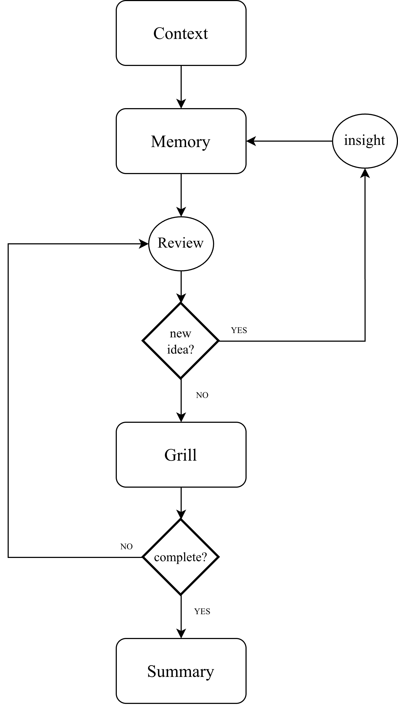

# Aha

一个用于 Insight-to-Judgment 的 Pi Extension。

把突然出现的想法，带着旧笔记一起走到一份可回看的判断草稿。

Aha 提供一条 `/insight` 工作流：你把当前想法、背景和可选的原始笔记贴进去，Agent 会帮你检索相关旧笔记、组织回看顺序、提出追问，并在你确认后输出 summary draft。

它重点降低的是这段认知阻力：从“我感觉这个想法很重要”，到“我能说清它连接了哪些旧经验、改变了什么判断、应该怎样沉淀下来”。

<p align="center">
  
</p>

## 快速开始

在 Pi 中输入：

```text
/insight
```

然后粘贴这几类内容：

- 当前想法：一句让你感觉需要更新理解的话。
- 背景：它来自哪里，正在回应什么问题。
- 原始笔记：可选，可以贴 Obsidian 原文或片段。
- 旧笔记线索：可选，如果你已经想到某些相关旧内容，可以写上标题或关键词。

也可以直接行内启动：

```text
/insight 这里写当前想法和背景
```

## 它帮你完成什么

### 找回旧记忆

很多想法出现时，只能隐约感觉它和过去某些笔记、项目、场景有关。Aha 会把当前想法交给 agent 生成多条结构化 QMD 查询，再用 QMD 和 Obsidian backlink 找回本地旧笔记。

### 降低重新翻找成本

你不用先在知识库里自己翻一轮。Aha 会先给出一张 agent rerank 后的候选表，让你从几个最可能相关的旧笔记开始看。

### 显影相似、反例和边界

旧笔记和当前想法的关系可能有几种：

- 支持：旧内容强化了当前想法。
- 挑战：旧内容让当前想法需要修正。
- 相似：旧内容来自别的领域，但结构很像。
- 边界：旧内容说明这个想法适用于哪里，停在哪里。

这一步的目的，是让你更快看到“这个想法到底改变了什么”。

### 保留追问过程

Agent 会围绕候选判断追问你：你接受哪部分，拒绝哪部分，哪里需要补充，是否真的形成了新判断。中间过程会保存在 `grill-context.md`，方便回看。

### 输出判断草稿

当你明确表示可以总结时，Agent 会输出一份 summary draft。它可以包括：

- 原始想法；
- 被更新的旧理解；
- 新形成的判断；
- 参与判断的旧笔记；
- 适用边界；
- 可能影响的行动；
- 仍未解决的问题。

## 工作流

```text
输入想法和背景
-> agent 生成多条 QMD 查询
-> QMD 检索旧笔记
-> 用 QMD top10 扩展 Obsidian backlinks
-> 合并候选并 agent rerank
-> 回看候选内容
-> 接受追问
-> 形成判断
-> 输出草稿
```

中间会形成一个小循环：你在 Review 旧笔记，Agent 在 Grill 你的判断。过程中如果出现新的重要想法，可以再次触发 memory search，继续找相关旧内容。

## 命令

```text
/insight
```

没有 active insight mode 时，打开编辑器并创建新 session。已经处在 insight mode 时，取消当前模式并清掉待注入上下文。

```text
/insight list
```

列出近期 session。

```text
/insight resume <session>
```

恢复某个旧 session。`<session>` 可以是 session id 或目录名片段。

```text
/insight current
```

查看当前 active session。

## 文件位置

session 默认保存在 Pi agent 的全局目录：

```text
~/.pi/agent/insights/
```

如果设置了 `PI_CODING_AGENT_DIR`，则保存在：

```text
$PI_CODING_AGENT_DIR/insights/
```

目录结构：

```text
insights/
  index.json
  sessions/
    yyyy-mm-dd-short-slug-sessionid/
      state.json
      grill-context.md
      summary-draft.md
```

每个想法都有独立 session 目录。`state.json` 会记录启动路径 `originCwd`，所以你可以知道这次 session 从哪里开始；session 本身集中保存在全局 insight storage 中，方便从不同项目路径继续使用。

## 设计原则

- 用户确认判断，Agent 提供检索、追问和草稿。
- 旧笔记是 memory candidates，需要用户 Review 后才进入最终判断。
- Summary 由用户明确触发，Agent 不自动跳到完成。
- 原始 Obsidian 笔记由用户掌控，扩展只输出建议和 draft。
- Pi core 保持不变，Aha 的产品能力放在 extension 层。
- 本地 JSON 记录 session state，让多阶段认知过程不会丢。

## 当前状态

已经支持：

- `/insight` 启动和恢复 session；
- QMD 结构化检索；
- QMD top10 seed backlink 扩展；
- QMD/backlink 候选合并和 agent rerank；
- memory candidate 表格；
- review-grill 过程记录；
- summary draft 保存；
- 跨路径 list / resume；
- QMD 超时后的进程组清理。
- Obsidian 插件 MVP：从当前笔记触发 Aha search，生成/复用 Aha Review Note，通过 wrapper 调用 OpenAI-compatible LLM、QMD SDK/CLI fallback 与 Obsidian CLI，并在 review note 中追加每一轮检索结果。
- wrapper 默认 `pipeline`：LLM 生成 3-5 条结构化 QMD query，wrapper 混合 QMD 与 Obsidian graph 检索、评分重排候选、读取 vault 内候选正文，再用 bounded Relation Judge 给出关系判断。

暂时还没有：

- 独立 Web UI；
- 自动修改 Obsidian 原文；
- 多 Agent 分发。

## Obsidian 插件 MVP

插件代码位于 `obsidian-plugin/`，wrapper 位于 `scripts/aha/`。这部分不迁移、不修改现有 `insight-package/`，只把 Obsidian 当作 Memory Surface：负责触发、生成 review note、打开候选笔记；检索编排与关系判断仍由 wrapper/LLM/QMD 侧负责。

本地验证：

```bash
cd obsidian-plugin
npm run verify
```

关键运行约束：

- Relation Judge、QMD、wrapper 传输或超时失败不会伪装成成功轮次；wrapper 会保留结构化 `{ ok:false, error:{ message, tool, details } }`，插件会把它写成 failed search record。
- Obsidian 桌面 App 的 PATH 可能没有 Node；插件会优先用设置里的 Node command，其次自动探测常见桌面安装路径，并用 Node 显式执行 wrapper，不再依赖 `#!/usr/bin/env node`。
- 候选正文读取只允许 `qmd://obsidian/...` 或 vault 内真实路径，避免把 vault 外文件内容带入 Relation Judge prompt。
- wrapper 会过滤当前 Aha Review Note 和 `Aha/Reviews/` 生成物，避免 Obsidian backlink 把 review shell 当成旧记忆候选。
- LLM 生成的多条 QMD plan query 会逐条执行，避免多个 QMD 检索争用 QMD/SQLite runtime；单条默认 30 秒超时。SDK runner 默认关闭 QMD 内部 rerank；CLI fallback 会给 QMD 传 `-C 20` 限制内部候选数。某条 QMD 慢或卡住时会作为 warning 保留，不会自动降级到 `qmd vsearch`。
- CLI 和插件侧外部进程都关闭 stdin、设置超时，并限制 stdout/stderr 缓冲大小。
- 搜索开始时插件会立即把 running record 写入 Review Note 的 Search Results 区块；成功或失败退出后替换为最新结果，避免后台状态不可见，同时不把 review note 变成追加式审计日志。
- `--target-candidates` 在 wrapper CLI 层也会限制到 15-20，和插件 UI slider 保持一致。
- Obsidian 插件默认使用 OpenAI-compatible API 做 query plan 与 Relation Judge：`provider=openai`、`baseUrl=https://api.openai.com/v1`、`model=gpt-5.5`。OpenAI API key 可直接填在插件设置里，插件会把它注入 wrapper 子进程环境；如果该字段留空，则回退读取本地环境变量，默认变量名是 `OPENAI_API_KEY`。
- 直接填写在插件里的 API key 会保存在当前 vault 的 Obsidian 插件数据中，只用于本机运行；不要把 `.obsidian/plugins/.../data.json` 或相关插件数据提交到仓库。
- OpenAI HTTPS 请求优先走 Node 内置请求；如果本地代理导致 Node TLS 握手被 reset，wrapper 会读取 `HTTPS_PROXY` / macOS 系统代理并用 curl fallback 发起同一请求，避免 Obsidian GUI 进程没有 shell 环境变量时失败。
- QMD 默认走 SDK runner，并关闭 QMD 内部 rerank；Aha 仍会执行多 query 混合召回、wrapper scoring、候选正文读取和 Relation Judge 重排。`qmdCommand` 仍保留，用于 SDK module 推导和 CLI fallback。
- Aha Review Note 会在 frontmatter 写入 `source_id`；桌面本地文件系统可用时使用 inode 级身份，因此 source note 改名、编辑大小或 mtime 变化后仍可复用同一个 review note。若只能降级到 ctime 身份，插件会要求 `source_path` 同时匹配，避免同时间戳碰撞污染别的 review note。
- Aha Review Note 的生成区块采用 marker-backed 替换语义；重新运行只保留最新 Search Results / Selected Memories / Grill Handoff，marker 外的人工记录不会被删除。
- wrapper 的 note identity 默认大小写不敏感，匹配当前 macOS/Obsidian vault 常用行为；测试里保留了大小写敏感选项，便于未来支持严格区分大小写的 vault。

## 评测

小评测集使用本地私有文件 `bench/aha-memory-cases.json`。每条 case 保存真实会输入 `/insight` 的原始内容来源，以及人工标注的 `gold.must` / `gold.nice` / `gold.noise` 笔记；这个文件默认被 Git ignore，不应提交。仓库只保留无隐私内容的 `bench/aha-memory-cases.example.json`。

第一次使用时，从模板复制一份：

```bash
cp bench/aha-memory-cases.example.json bench/aha-memory-cases.json
```

case v3 结构：

- `state`：`active` 默认计分；`draft` 候选待确认；`off` 保留但不使用。
- `title`：报告里的短标题，不参与评分。
- `input`：真实会给 `/insight` 的输入：
  - `input.note`：可选，原始 insight 所在笔记。
  - `input.lines`：有 note 时默认填写，1-based inclusive 行号范围。
  - `input.whole_note`：仅当整篇 note 就是原始输入时显式设为 `true`。
  - `input.thought`：真实想法；有 note 时作为补充，没有 note 时就是完整输入。
- `gold`：评分标签：
  - `gold.must`：必须召回，缺失算硬失败。
  - `gold.nice`：召回很好，缺失不算硬失败。
  - `gold.noise`：看似相关但应视为噪声。
- `why`：标注理由，不参与 query 生成、rerank 或最终分数。

旧字段 `status` / `source_note_path` / `insight_input` / `must_recall` / `nice_to_have` / `negative` 仍可被读取用于迁移，但新文件应使用 v3。

主 benchmark 只放真实 insight case；路径解析、重复文件名、missing cue、source-note self-hit 等技术回归 case 不进入主分，可以放在 ignored 的 `bench/aha-memory-regression-cases.json`。

如果 case 来自笔记片段，优先用 `input.note + input.lines`；benchmark runner 只会把这段行号切片交给后续 query/rerank 流程。可以先预览精确片段，避免整篇 note 污染输入：

```bash
node scripts/bench/extract-note-excerpt.mjs \
  --note "Projects/path/to/source.md" \
  --lines 8:20 \
  --vault-root "$HOME/Obsidian Notes"
```

按 case 预览：

```bash
node scripts/bench/extract-note-excerpt.mjs --case aha-001 --full-input
```

Review Note 里的反馈动作会先生成可见 seed，不会直接写入正式私有 benchmark：

- `accept` -> 草稿 `gold.nice` seed。
- `reject_as_noise` -> 草稿 `gold.noise` seed。
- `should_have_found` -> 草稿 `gold.must` seed。

为了避免手工从 Markdown 复制字段，可以把这些 Review Note seeds 聚合成一个 ignored 的 benchmark-like inbox：

```bash
node scripts/bench/collect-review-seeds.mjs \
  --vault-root "$HOME/Obsidian Notes" \
  --output bench/aha-memory-seed-cases.json
```

`bench/aha-memory-seed-cases.json` 同样被 Git ignore。它按 source note 聚合成 `state: draft` v3 cases：

- `accept` 聚合进 `gold.nice`。
- `reject_as_noise` 聚合进 `gold.noise`。
- `should_have_found` 聚合进 `gold.must`。
- 如果某个 source 只有 `accept` / `reject_as_noise`，collector 会加 `expected_no_recall: true`，让它仍然是合法 draft case。
- 如果同一条 memory 被标成多个 label，collector 会按 `must > noise > nice` 保留一个标签，并写入 `seed_label_conflicts`，提醒人工检查。
- 由于当前 Review Note 不记录 source line range，seed inbox 会显式写 `input.whole_note: true`；提升到 active 前最好替换成 `input.lines`。

你需要人工决定的是：哪些 draft case 值得进入 `bench/aha-memory-cases.json`，以及何时把 `state` 从 `draft` 改成 `active`。collector 不会自动修改 `bench/aha-memory-cases.json`。

想单独 smoke 这些 draft seed cases，可以显式指定 seed inbox：

```bash
node scripts/bench/run-pipeline-bench.mjs \
  --cases bench/aha-memory-seed-cases.json \
  --include-draft
```

Aha eval-v2 的产品目标是：在十条候选的 Review Attention Budget 里，提高有价值旧记忆的浓度，同时降低噪声泄漏。

主要指标（默认 `@10`）：

- `Must Recall@10`：必须召回的旧笔记有多少进入最终前 10。
- `Useful Precision@10`：前 10 中 `must_recall + nice_to_have` 的有效命中比例。
- `nDCG@10`：排序质量；`must_recall` 权重大于 `nice_to_have`，`negative` 单独计噪声。
- `Negative Rate@10`：前 10 中主动负例/噪声命中的比例。

诊断指标：

- `Expanded Pool Recall@20`：QMD + backlink 合并池在更宽的 20 条诊断预算里是否已经触达答案。
- `Dropped Must Count`：expanded pool 已触达、但最终前 10 没保住的 must-recall 数量；包括最终排在第 11 名之后的情况。
- `Stability@10`：确定性报告里最终前 10 顺序的稳定性/指纹。
- `Failure Attribution`：失败/低质量 case 的单一主因分组：`case_label_failure`、`input_representation_failure`、`query_failure`、`retrieval_failure`、`rerank_failure`、`relation_failure`；可附加 secondary flags。

L1 只测 QMD 直接召回：

```bash
node scripts/bench/run-qmd-bench.mjs
```

L2 近似真实 `/insight` retrieval：

```bash
node scripts/bench/run-pipeline-bench.mjs
```

L2 流程是：

```text
raw insight input
-> query-generation agent 生成 3-5 条 intent/lex/vec/hyde 查询
-> 逐条调用 QMD SDK/CLI
-> 用 QMD top10 作为 backlink seeds
-> 合并 QMD/backlink 候选
-> rerank agent 排序
-> 计算 eval-v2 primary metrics + diagnostics
```

最新报告写到：

```text
bench/reports/latest/qmd.json
bench/reports/latest/pipeline.json
```

时间戳历史报告写到：

```text
bench/reports/archive/
```

Eval-v2 代码/文档变更的最小验证路径：

```bash
node --test scripts/aha/tests/aha-bench-eval-v2.test.mjs
node --test scripts/aha/tests/review-note.test.mjs
node --test scripts/aha/tests/review-seeds-collector.test.mjs
node --check scripts/bench/collect-review-seeds.mjs
node --check scripts/bench/run-pipeline-bench.mjs
node --check scripts/bench/summarize-report.mjs
cd obsidian-plugin && npm run verify
```

## 开发与验证

标准回归测试：

```bash
INSIGHT_EXTENSION_PATH=/path/to/Aha/insight-package/extensions/insight.ts bun scripts/insight/test-extension.mjs
```

对抗式 QA：

```bash
INSIGHT_EXTENSION_PATH=/path/to/Aha/insight-package/extensions/insight.ts bun scripts/insight/ultraqa-extension.mjs
```

Package 内部回归：

```bash
cd insight-package
bun run build
bun run test
bun run test:ultraqa
```

构建检查 Aha extension：

```bash
bun build /path/to/Aha/insight-package/extensions/insight.ts --target=node --outfile=/tmp/insight-extension-build.js
```

Pi 加载烟测：

```bash
pi --verbose --offline --no-tools --print ""
```
