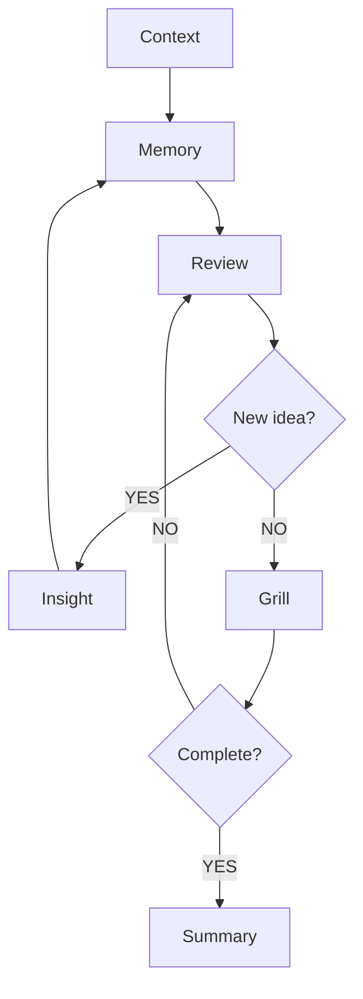

# Insight-to-Judgment Agent：项目理解与基础实现方案

## 1. 项目背景

我想开发一个基于 Pi Agent 二次开发的认知工作流 Agent。它的核心目标不是帮我保存更多资料，也不是单纯总结笔记，而是帮助我把零散的 insight 转化成更稳定、可复用、可行动的判断。

在实际使用 AI、阅读材料、观看影视内容、浏览帖子或整理项目想法时，我经常会捕捉到一些有启发的观点。它们当下会让我觉得“这个很重要”“这个好像改变了我的理解”，但如果没有进一步处理，这些 insight 很容易变成截图、收藏、碎片笔记，最后并没有真正进入我的旧认知、当前项目和行动决策中。

因此，这个 Agent 的核心价值是：

> 通过 Memory 检索、Review 旧内容、Grill Me 追问和 Summary 沉淀，帮助我完成从“零散 insight”到“清晰判断”的转化。

## 2. 产品核心

这个项目的核心不是知识管理，而是判断转化。

它要解决的问题是：

- 捕捉到 insight 后，我很难系统连接过去的旧笔记；
- 仅凭自己的记忆进行联想，容易遗漏很多相关内容；
- 旧笔记中可能存在跨领域相似结构，但我自己不一定能想起来；
- AI 可以帮我发掘相关旧内容，但需要一个稳定流程来控制它不跑偏；
- Grill Me 追问可以帮助我显影隐含判断，但需要和 Memory 结合；
- 最后生成的文档不能只是 AI 说得好，而要尽量转化成我自己确认过的判断。

一句话概括：

> 这个 Agent 要做的是把短暂启发变成可回看、可复用、可继续更新的判断。

## 3. 基础流程

当前流程图可以理解为以下闭环：




流程说明：

1. **Context**
   当前输入的背景信息，例如我正在看的内容、正在思考的问题、当前项目上下文。
2. **Insight**
   用户捕捉到的一个零散 insight，可能来自电视剧、文章、X 帖子、AI 对话、项目经验等。
3. **Memory**
   通过 gbrain cli 或 MCP 检索相关旧笔记、旧判断、旧项目、旧场景。
4. **Review**
   回看 Memory 检索出的内容，判断它们和当前 insight 的关系。
5. **New idea?**
   如果 Review 过程中产生新的 insight，则重新进入 insight → memory 的循环，继续检索和连接。这个是能从用户回复中提取到或者用户明确说明需要重新去调用memory找旧笔记的。
6. **Grill**
   当没有新的检索方向后，进入 Grill Me 追问。目标是逼用户表态、修正、反驳、确认真正想挖掘的判断。
7. **Complete?**
   判断当前追问是否足够。如果还没有完成，则回到 Review，继续补充旧材料或重新审视已有内容。用户可以显式说名。
8. **Summary**
   当判断相对清晰后，根据用户的原始obsidian文档输出一份draft，不要修改原始笔记内容。

## 4. 最小闭环

最小可跑通版本不追求复杂功能，只需要完成：

```text
输入 insight
→ 检索 Memory
→ Review 相关旧内容
→ Grill Me 追问
→ 形成新判断
→ 输出 Summary draft
```

这个闭环的关键是：
不是让 AI 直接写文章，而是让 AI 帮我更快看到：

- 这个 insight 可能挑战了我过去什么想法；
- 它和哪些旧笔记、旧项目、旧场景有关；
- 我是否真的接受这个新判断；
- 它最后能不能被压缩成一张清晰的判断卡。

## 5. 状态管理设计

状态管理是这个 Agent 的核心。因为这个流程不是一次性问答，而是一个多阶段认知过程。

Agent 需要知道当前处于哪个阶段，以及每个阶段已经产生了什么中间结果。

### 5.1 Session State

每次 insight 挖掘可以看作一个 `InsightSession`。

```ts
type InsightSession = {
  id: string

  stage:
    | "context"
    | "memory"
    | "review"
    | "grill"
    | "summary"
    | "complete"

  context?: string
  rawInsight: string

  memoryQueries: string[]
  retrievedNotes: MemoryNote[]

  reviewedNotes: ReviewedNote[]
  newInsights: string[]

  grillQuestions: string[]
  userAnswers: string[]

  candidateJudgments: CandidateJudgment[]
  acceptedJudgment?: string

  summary?: string
  judgmentCard?: JudgmentCard

  unresolvedQuestions: string[]
}
```

### 5.2 Stage 的意义

`stage` 用来控制 Agent 当前应该做什么，避免它直接跳到总结或写文章。

例如：

- 在 `memory` 阶段，Agent 主要负责生成检索 query，并调用 gbrain 获取旧笔记；
- 在 `review` 阶段，Agent 主要负责解释旧笔记和 insight 的关系；
- 在 `grill` 阶段，Agent 主要负责追问，而不是继续扩写；
- 在 `summary` 阶段，Agent 才可以沉淀文档或判断卡。

这和单纯 prompt 的区别在于：

> prompt 是让模型“记得应该这样做”，状态管理是让系统“只能按这个阶段推进”。

### 5.3 Review State

Review 阶段需要记录每条旧笔记的作用。

```ts
type ReviewedNote = {
  noteId: string
  title: string
  relation:
    | "directly_related"
    | "cross_domain_similarity"
    | "counterexample"
    | "background"
  reason: string
  selected: boolean
}
```

这样做的目的不是把所有笔记都展示给用户，而是帮助用户快速判断：

- 哪些旧内容真的相关；
- 哪些只是跨领域相似；
- 哪些可能构成反例；
- 哪些暂时可以忽略。

### 5.4 Candidate Judgment

在 Review 和 Grill 后，Agent 需要提出候选判断，但不能直接当作用户真实判断。

```ts
type CandidateJudgment = {
  text: string
  evidenceNoteIds: string[]
  confidence: "low" | "medium" | "high"
  userStatus: "pending" | "accepted" | "rejected" | "revised"
}
```

关键原则：

> AI 只能提出候选判断，最终判断需要用户确认或修正。

### 5.5 Judgment Card

最终沉淀的核心不是长文，而是一张结构化判断卡。与用户原始的obsidian笔记相关。以笔记的结构为主。

```ts
type JudgmentCard = {
  insight: string
  oldJudgment?: string
  newJudgment: string
  relatedNotes: string[]
  keyEvidence: string[]
  boundary?: string
  linkedProblem?: string
  actionAnchor?: string
  unresolvedQuestions: string[]
}
```

它应该回答：

- 这个 insight 是什么；
- 它改变了什么旧判断；
- 我现在形成了什么新判断；
- 它连接了哪些旧笔记；
- 它适用于哪个当前问题；
- 它下一步会影响什么行动；
- 还有什么没想清楚。

## 6. Memory 获取方式

Memory 暂时不需要复杂设计，先通过 gbrain cli 或 MCP 获取即可。

基础能力包括：

```text
search_memory(query)
read_memory_note(noteId)
```

后续可以扩展：

```text
find_related_notes(insight)
find_cross_domain_connections(insight)
write_judgment_card(card)
```

第一版只需要保证：

- 可以基于 insight 生成 query；
- 可以从 gbrain 中检索旧笔记；
- 可以读取笔记内容；
- 可以把最终 judgment card 保存回 gbrain memory。

## 7. Grill Me 的实现方式

Grill 部分通过 skill 实现。skill会在项目文件夹下生成一个CONTEXT.md文档，和那张判断卡片有点类似。

它的作用是制造高质量阻力，帮助用户从模糊直觉走向清晰判断。

具体skill内容可以看skill 叫“grill-insight”

## 8. 暂不做的内容

当前阶段暂时不重点开发：

- TUI 交互；
- 多 Agent 分发；
- 复杂 memory ranking；
- 自动长期评估；
- 完整知识库系统；
- 大规模产品化功能。

这些可以后续再做。

当前最重要的是跑通核心闭环：

```text
Insight → Memory → Review → Grill → Summary
```

## 9. 实现重点

第一阶段的实现重点是：

1. 定义 `InsightSession` 状态结构；
2. 定义每个 stage 的推进规则；
3. 接入 gbrain cli / MCP 获取 Memory；
4. 接入 Grill Insight skill 做追问；
5. 输出结构化 Judgment Card；
6. 将最终结果保存回本地文档或 Memory 系统。

最小实现可以先用命令行交互，不需要复杂 UI。

## 10. 项目最终目标

这个 Agent 的长期目标是成为一个认知工作流助手。

它要帮助我在面对零散 insight 时，不只是收藏和总结，而是系统地完成：

```text
捕捉 insight
→ 连接旧记忆
→ 回看旧判断
→ 接受追问
→ 形成新判断
→ 沉淀为可复用 artifact
```

最终，它应该减少我重新翻找、重新理解、重新组织的成本，让过去的笔记和新的 insight 更容易发生连接，并帮助我形成更清晰、更稳定、更能进入行动的判断。

---

Pi Agent相关材料，这是Pi Agent的设计哲学以及一些架构和参考资料

https://zhanghandong.github.io/pi-book/ch30-minimal-core.html

https://zhanghandong.github.io/pi-book/ch31-contrarian-choices.html

https://zhanghandong.github.io/pi-book/ch32-boundaries.html

